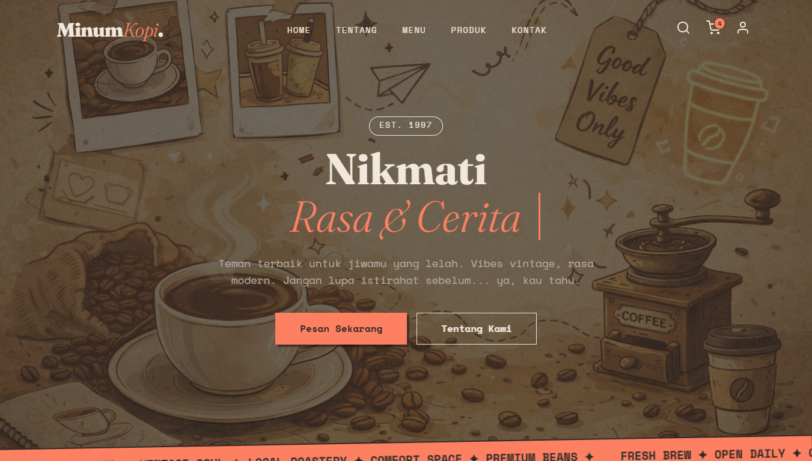

# MinumKopi - Authentic Coffee Space ☕




**MinumKopi** adalah sebuah landing page modern dan responsif yang dirancang untuk kedai kopi dengan konsep *vintage-modern*. Proyek ini mendemonstrasikan kemampuan pengembangan antarmuka pengguna (UI) yang elegan, interaksi pengguna yang mulus, dan struktur kode yang semantik.

Website ini dibangun dengan fokus pada pengalaman pengguna (UX), menampilkan transisi halus, tata letak yang adaptif, dan fitur interaktif tanpa ketergantungan pada framework CSS yang berat.

## 🌟 Fitur Utama

* **Responsive Design:** Tata letak yang sepenuhnya adaptif untuk berbagai ukuran layar (Desktop, Tablet, Mobile) menggunakan CSS Flexbox dan Grid.
* **Modern UI/UX:**
    * *Glassmorphism Navbar* yang memberikan efek blur saat digulir.
    * Animasi *Scroll Reveal* menggunakan Intersection Observer API.
    * Transisi elemen yang halus (Hover effects, Floating cards).
* **Interactive Components:**
    * Sidebar Keranjang Belanja (*Shopping Cart*) yang dinamis.
    * Formulir Pencarian (*Search Bar*) dengan animasi toggle.
    * Panel Login/Register yang dapat diganti (*switchable forms*).
* **Aset & Tipografi:** Penggunaan Google Fonts (Fraunces & Space Mono) untuk menciptakan identitas visual yang kuat.

## 🛠️ Teknologi yang Digunakan

Proyek ini dibangun menggunakan teknologi web standar dengan praktik terbaik (*best practices*):

| Teknologi | Deskripsi |
| :--- | :--- |
| **HTML5** | Struktur semantik dokumen web. |
| **CSS3** | Styling tingkat lanjut menggunakan *Custom Properties (Variables)*, Keyframe Animations, dan Media Queries. |
| **JavaScript (ES6+)** | Logika interaktif, manipulasi DOM, dan Event Handling. |
| **Feather Icons** | Ikonografi yang ringan dan bersih. |
| **Font Awesome** | Ikon sosial media dan elemen UI tambahan. |

## 📂 Struktur Folder

```text
minumkopi/
├── css/
│   └── style.css       # Stylesheet utama
├── img/
│   ├── favicon/        # Aset ikon website
│   ├── product/        # Gambar produk kopi
│   ├── profile/        # Gambar testimoni pelanggan
│   └── background.webp # Gambar hero section
├── screenshot/
│   └── preview-website.png # Screenshot tampilan website
├── js/
│   └── script.js       # Logika JavaScript utama
├── index.html          # Halaman utama
└── README.md           # Dokumentasi proyek